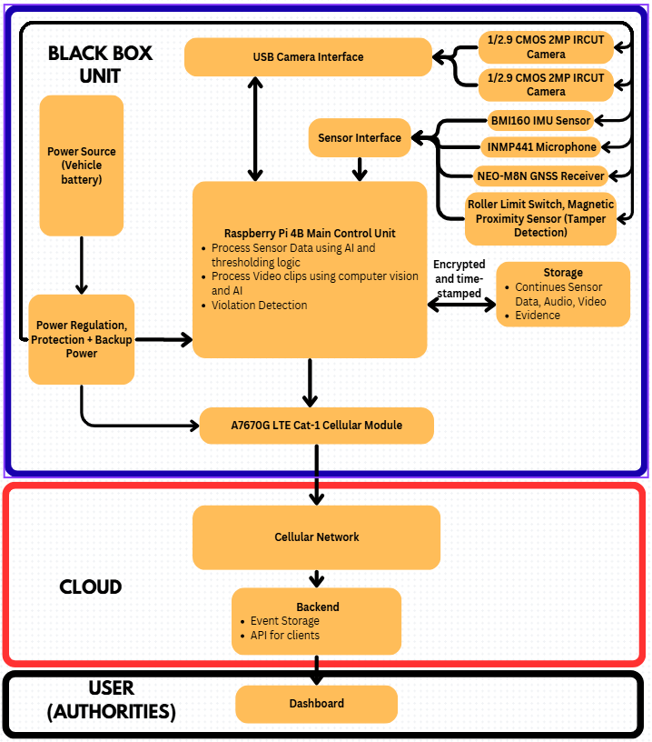
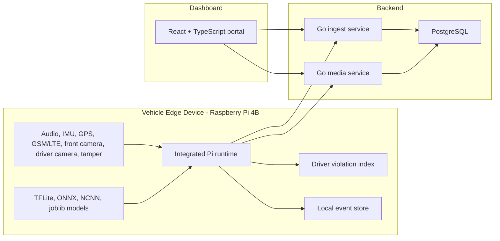

# Vehicular Black Box: Vehicle Violation Detector

This repository is the flagship system repo for a 3-member Final Year Project: a Raspberry Pi based vehicular black-box prototype that detects risky driving and cabin/road violations, records structured evidence events, uploads them through GSM/LTE, and displays driver/device history in a web dashboard.

The repo packages the integrated edge runtime, backend services, dashboard, driver violation scoring, hardware notes, and deploy model artifacts. The individual ML repositories remain as deeper module-level references.

> Status: FYP prototype. This is not production, legal, insurance, emergency-response, or certified vehicle-safety software.

## One-Minute Summary

The system runs on a Raspberry Pi 4B edge device connected to cameras, microphone/audio input, IMU, GPS, GSM/LTE, tamper sensing, and custom PCB/power hardware. It detects events such as horn abuse, wake-word/phone-call cues, shouting, harsh braking, lane change, aggressive driving, crash signals, drowsiness, road signs, road-line crossing, speeding/location risk, and tamper. Events are aggregated locally, scored into a driver violation index, and uploaded to Go backend services for storage and dashboard viewing.

## Architecture





## Modules

| Module | Signal | Method | Deploy artifact | Output |
| --- | --- | --- | --- | --- |
| Horn abuse | Audio | CNN audio classifier | TFLite | `horn` |
| Hello / phone-call cue | Audio | CNN wake-word fallback | ONNX | `phone_call` |
| Shouting | Audio | CNN audio classifier | TFLite | `shouting` |
| Harsh braking | IMU | CNN time-window model | TFLite | `harsh_braking` |
| Lane change | IMU | Feature/window classifier | joblib | `abrupt_lane_change` |
| Aggressive driving | IMU | XGBoost/tabular classifier | joblib | `aggressive_driving` |
| Crash | Audio + IMU | Audio CNN plus IMU CNN-GRU | ONNX + TFLite | `crash` |
| Drowsiness | Driver camera | Eye-state/drowsiness runtime | TFLite / MediaPipe runtime | `driver_drowsiness` |
| Road signs | Front camera | YOLO detector plus ONNX classifier | NCNN / ONNX | speeding/no-honking rules |
| Road-line crossing | Front camera | Segmentation plus line-crossing logic | ONNX | line crossing event |
| Speeding / GPS | GPS + road sign context | Rule logic | Runtime code | `speeding` |
| Tamper | GPIO/switch input | Rule logic | Runtime code | `tamper` |
| GSM/LTE upload | Modem/network | HTTP upload client | Runtime code | event upload |
| Backend | API + storage | Go services + PostgreSQL | source | event/media APIs |
| Dashboard | Web UI | React, TypeScript, Tailwind | source | device/event views |

## Repository Layout

```text
edge_device/raspberry_pi_deploy/       Integrated Pi runtime and deploy models
edge_device/standalone_module_scripts/ Earlier standalone module runtimes, kept for reference
edge_device/drowsiness_runtime/        Separate drowsiness runtime and environment
backend/ingest-service/                Go event/device/scoring API
backend/media-service/                 Go media evidence service
frontend/vehicular-bbx-portal/         React dashboard
scoring/driver_violation_index/        Python driver risk index model
hardware/pcb/                          PCB visuals and Gerber hardware deliverables
docs/                                  System documentation
```

## Quick Start

Backend ingest service:

```bash
cd backend/ingest-service
cp .env.example .env
go test ./...
go run .
```

Backend media service:

```bash
cd backend/media-service
cp .env.example .env
go test ./...
go run .
```

Dashboard:

```bash
cd frontend/vehicular-bbx-portal
cp .env.example .env.local
pnpm install --frozen-lockfile
pnpm run build
pnpm dev
```

Raspberry Pi runtime:

```bash
cd edge_device/raspberry_pi_deploy
python -m venv .venv
source .venv/bin/activate
pip install -r requirements-pi.txt
python -m pi_runtime.main --config config/pi_runtime.json --check-only
python -m pi_runtime.main --config config/pi_runtime.json
```

Windows PowerShell equivalent for the check:

```powershell
cd edge_device\raspberry_pi_deploy
python -m pi_runtime.main --config config\pi_runtime.json --check-only
```

## ML Deep-Dive Repos

- Road signs: https://github.com/Dinuxd/road-sign-detection-yolo-onnx
- Horn detection: https://github.com/Dinuxd/vehicle-horn-detection-audio-cnn
- Crash detection: https://github.com/Dinuxd/crash-detection-audio-imu-fusion
- Lane change: https://github.com/Dinuxd/lane-change-detection-imu
- Aggressive driving: https://github.com/Dinuxd/aggressive-driving-detection-imu
- Harsh braking: https://github.com/Dinuxd/harsh-braking-detection-imu

## Dataset Notes

Raw datasets are intentionally not committed here. The IMU driving-event dataset was created for the project and is published externally:

- Zenodo: https://zenodo.org/records/20807506
- Kaggle: https://www.kaggle.com/datasets/dinupadevinda/byd-atto-bmi160-imu-driving-events

The aggressive-driving module also references selected non-media metadata from the Hugging Face Extreme Driving Conditions dataset:

- Hugging Face: https://huggingface.co/datasets/Stary108/Extreme_Driving_Conditions_Dataset

The road-sign module uses a Sri Lankan traffic-sign dataset source from Roboflow:

- Roboflow Universe: https://universe.roboflow.com/traffic-signs-in-sri-lanka/traffic-signs-in-sri-lanka

Horn detection also references an external audio dataset source:

- Mendeley: https://data.mendeley.com/datasets/y5stjsnp8s/2

## More Docs

- [System design](SYSTEM_DESIGN.md)
- [Dataset notes](docs/datasets.md)
- [Dependencies](DEPENDENCIES.md)
- [Limitations](LIMITATIONS.md)
- [Security and privacy](SECURITY_AND_PRIVACY.md)
- [Contributors](CONTRIBUTORS.md)
- [Raspberry Pi setup](docs/raspberry_pi_setup.md)
- [Backend API](docs/backend_api.md)
