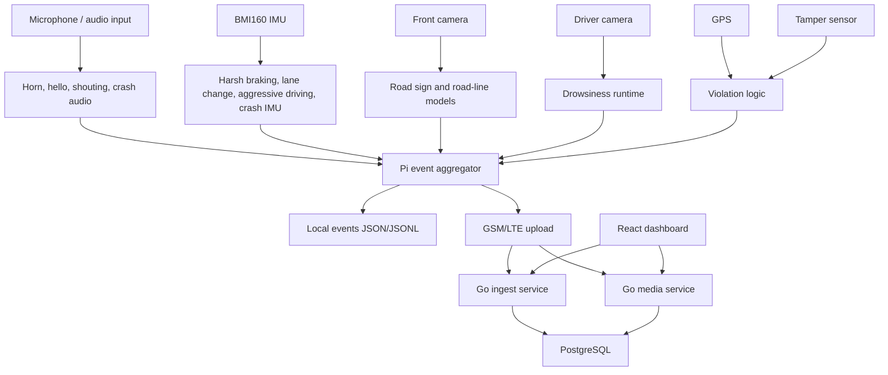

# Architecture

The architecture has three layers:

1. Edge sensing and inference on Raspberry Pi 4B.
2. Backend ingestion/media APIs with PostgreSQL storage.
3. Dashboard views for devices, events, GPS, and scoring.

